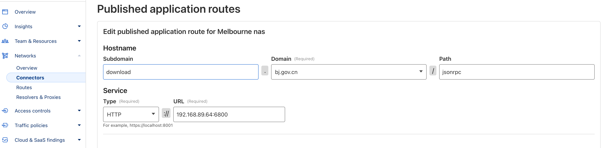
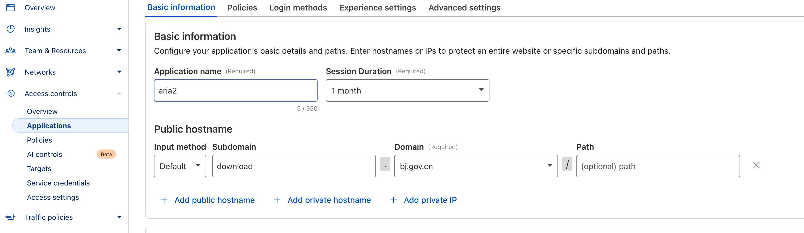

# AriaNg
[](https://github.com/seiry/AriaNg/blob/master/LICENSE)
[](https://circleci.com/gh/seiry/AriaNg/tree/master)
[](https://github.com/seiry/AriaNg/releases)

## difference


### 中文  

* 在对等列表中添加国家信息，可以查看每个对等好友的国家！
  * 神秘菜谱来自库 https://www.npmjs.com/package/use-mmdb-vanilla），这是一个猴子补丁，因为我对旧的angular不太熟悉。。。。。
  * 因为我的好奇心很强，总想知道奇奇怪怪的ip是哪个国家的，一个一个的查多麻烦呀，所以我们需要全自动！
  
* 通过环境变量添加配置文件注入，这样就可以在docker里实现一次配置，到哪都能打开面板。
  * 其实这个需求的的根本来源是 https://github.com/alexhua/Aria2-Explorer 没有Firefox版本。。。。
  * 魔法配方来自 https://gitlab.com/remyj38/dockerfiles/-/blob/ariang/README.md
  * 为了安全起见，也是最方便的实践起见，这个用法需要配合cloudflare zero trust。
    * jsonrpc 如图一，把6800重写到jsonrpc path就行了
    * 然后非常简单，把面板作为zero trust application，整个domain都绑定，不写path，就行了。
    * 这样就非常方便的都到了单一domain之下，非常方便，而且安全。妈妈再也不用担心我裸连6800，被蔡奇叔叔发现了。
    * 因为蔡书记当初对我们分局的网络安全要求比较严格，所以是不允许主动暴露端口到公网的，所以服务都是采取 cloudflared 主动转发。上网不涉密 涉密不上网，作为2025年的最佳实践，请在任何时候都使用cloudflared，当然cloudflare炸了的时候除外 :doge: 。





#### 一个参考的 docker-compose.yml

```yaml
services:
  AriaNg:
    image: seiry/ariang:latest
    environment:
      - ARIA_HOST=download.bj.gov.cn
      - ARIA_PORT=443
      - ARIA_PROTOCOL=https
      - ARIA_SECRET=xjp
      - ARIA_INTERFACE=jsonrpc
    network_mode: bridge
    ports:
      - 6880:80
    restart: unless-stopped
    logging:
      driver: json-file
      options:
        max-size: 1m
  
  Aria2-Pro:
    image: p3terx/aria2-pro
    cpuset: "0-1"
    environment:
      - PUID=0
      - PGID=0
      - UMASK_SET=022
      - RPC_SECRET=xjp
      - RPC_PORT=6800
      - LISTEN_PORT=6888
      - DISK_CACHE=64M
      - IPV6_MODE=false
      - UPDATE_TRACKERS=true
      - CUSTOM_TRACKER_URL=
      - TZ=Asia/Shanghai
    volumes:
      - ~/aria2:/config
      - ~/download:/downloads
    network_mode: bridge
    ports:
      - 6800:6800
      - 6888:6888
      - 6888:6888/udp
    restart: unless-stopped
    logging:
      driver: json-file
      options:
        max-size: 1m

```
### English
* add country info to the peer list, you can view the country of each peer friend!
  * (with the lib https://www.npmjs.com/package/use-mmdb-vanilla), which is a monkey patch, for I'm not that familiar with old angular.
* add config file injection via environment variables

with **no** i18n support, for personal use only.

## Introduction
AriaNg is a modern web frontend making [aria2](https://github.com/aria2/aria2) easier to use. AriaNg is written in pure html & javascript, thus it does not need any compilers or runtime environment. You can just put AriaNg in your web server and open it in your browser. AriaNg uses responsive layout, and supports any desktop or mobile devices.

## Features
1. Pure Html & Javascript, no runtime required
2. Responsive design, supporting desktop and mobile devices
3. User-friendly interface
    * Sort tasks (by name, size, progress, remaining time, download speed, etc.), files, bittorrent peers
    * Search tasks
    * Retry tasks
    * Adjust task order by dragging
    * More information of tasks (health percentage, client information of bt peers, etc.)
    * Filter files by specified file types (videos, audios, pictures, documents, applications, archives, etc.) or file extensions
    * Tree view for multi-directory task
    * Download / upload speed chart for aria2 or single task
    * Full support for aria2 settings
4. Dark theme
5. Url command line api support
6. Download finished notification
7. Multi-languages support
8. Multi aria2 RPC host support
9. Exporting and Importing settings support
10. Less bandwidth usage, only requesting incremental data

## Screenshots
#### Desktop

#### Mobile Device


## Installation
AriaNg now provides three versions, standard version, all-in-one version and [AriaNg Native](https://github.com/mayswind/AriaNg-Native). Standard version is suitable for deployment in the web server, and provides on-demand loading. All-In-One version is suitable for local using, and you can download it and just open the only html file in browser. [AriaNg Native](https://github.com/mayswind/AriaNg-Native) is also suitable for local using, and is no need for browser. 

#### Prebuilt release
Latest Release: [https://github.com/seiry/AriaNg/releases](https://github.com/seiry/AriaNg/releases)

Latest Daily Build (Standard Version): [https://github.com/mayswind/AriaNg-DailyBuild/archive/master.zip](https://github.com/mayswind/AriaNg-DailyBuild/archive/master.zip)

#### Building from source
Make sure you have [Node.js](https://nodejs.org/), [NPM](https://www.npmjs.com/) and [Gulp](https://gulpjs.com/) installed. Then download the source code, and follow these steps.

##### Standard Version

    $ npm install
    $ gulp clean build

##### All-In-One Version

    $ npm install
    $ gulp clean build-bundle

The builds will be placed in the dist directory.

#### Usage Notes
Since AriaNg standard version loads language resources asynchronously, you may not open index.html directly on the local file system to run AriaNg. It is recommended that you can use the all-in-one version or deploy AriaNg in a web container or download [AriaNg Native](https://github.com/mayswind/AriaNg-Native) that does not require a browser to run.

## Translating

Everyone is welcome to contribute translations. All translations files are put in `/src/langs/`. You can just modify and commit a new pull request.

If you want to translate AriaNg to a new language, you can add language configuration to `/src/scripts/config/languages.js`, then copy `/i18n/en.sample.txt` to `/src/langs/` and rename it to the language code to be translated, then you can start the translation work.

Currently available translations:

| Tag | Language | Contributors |
| --- | --- | --- |
| cz-CZ | Čeština | [@vorm04](https://github.com/vorm04) |
| de-DE | Deutsch | [@Malonsow](https://github.com/Malonsow) |
| en | English | / |
| es | Español | [@castillofrancodamian](https://github.com/castillofrancodamian) |
| fr-FR | Français | [@Valaraukar86](https://github.com/Valaraukar86) |
| it-IT | Italiano | [@ale-saglia](https://github.com/ale-saglia) |
| pl-PL | Polski | [@Pirania3680](https://github.com/Pirania3680) |
| ru-RU | Русский | [@gazizovemil](https://github.com/gazizovemil) |
| zh-Hans | 简体中文 | / |
| zh-Hant | 繁體中文 | [@zhtw2013](https://github.com/zhtw2013) [@ChiaYen-Kan](https://github.com/ChiaYen-Kan) |

Don't see your language? Help us add it!

## Documents
1. [English](http://ariang.mayswind.net)
2. [Simplified Chinese (简体中文)](http://ariang.mayswind.net/zh_Hans)

## Demo
Please visit [http://ariang.mayswind.net/latest](http://ariang.mayswind.net/latest)

## Third Party Extensions
There are some third-party applications based on AriaNg, so you can use AriaNg in more scenarios or devices. Please visit [Third Party Extensions](http://ariang.mayswind.net/3rd-extensions.html) for more information.

## License
[MIT](https://github.com/mayswind/AriaNg/blob/master/LICENSE)

## docker


AriaNG image served by nginx

### Environment variables

|     Variable     |       Description       |  Default  |                           Allowed                           |
|------------------|-------------------------|-----------|-------------------------------------------------------------|
| ARIA_HOST        | Aria hostname           | localhost |                                                             |
| ARIA_PORT        | Aria port               | 6800      |                                                             |
| ARIA_INTERFACE   | Aria interface base URL | jsonrpc   |                                                             |
| ARIA_PROTOCOL    | Aria protocol           | http      | `http`, `https`, `ws` (websocket), `wss` (websocket secure) |
| ARIA_HTTP_METHOD | Aria http method        | POST      | `GET`, `POST`                                               |
| ARIA_SECRET      | Secret for Aria         |           |                                                             |

### Usage
```
docker run -p80:80 -eARIA_HOST=172.17.0.1 -eARIA_PORT=8080 --name ariang -d seiry/ariang
```

https://gitlab.com/remyj38/dockerfiles/-/blob/ariang/README.md

### github merge back link

https://github.com/seiry/AriaNg/compare/master...mayswind:AriaNg:master
